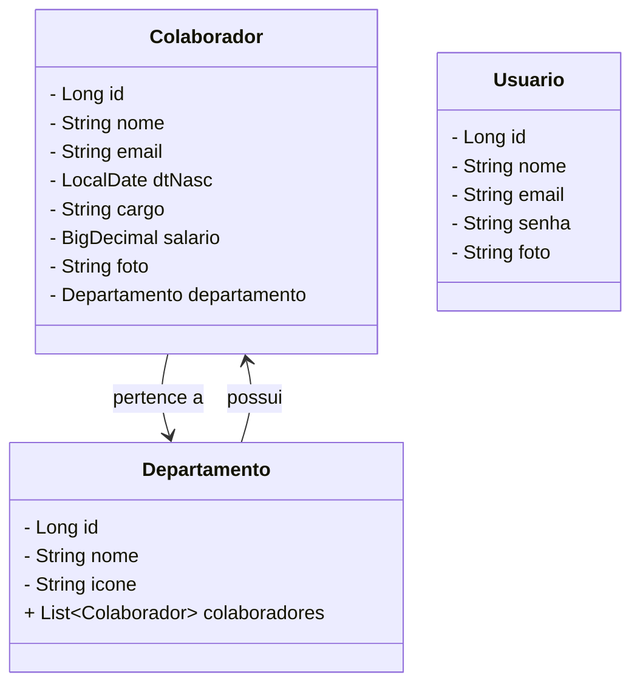
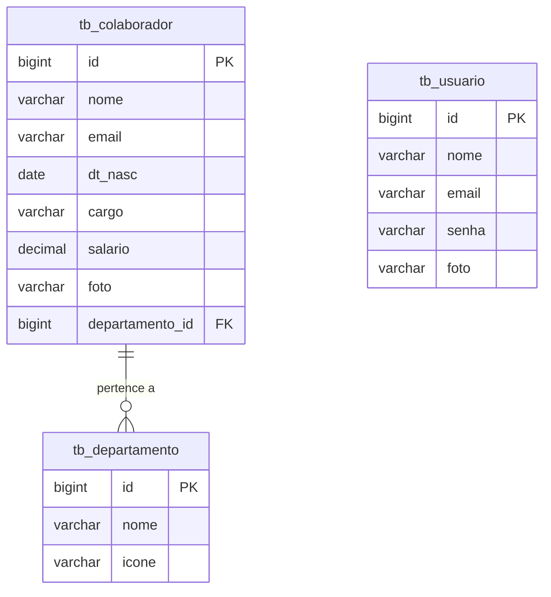

<div align="center">
  
</div>
<div align="center">
  <a href="https://git.io/typing-svg">
    
  </a>
</div>

---

## 👥 1. Descrição

O ConectaRH é um projeto integrador voltado à transformação humana e organizacional. Ele une tecnologia, empatia e gestão de pessoas para promover relações de trabalho mais humanas, produtivas e sustentáveis. A proposta é oferecer uma consultoria moderna e acessível em Recursos Humanos, com foco no desenvolvimento de talentos, fortalecimento de equipes e aprimoramento da cultura organizacional.

---

## ⚙️ 2. Sobre esta API

A API foi construída em Java com Spring Boot e oferece funcionalidades completas para o gerenciamento de colaboradores, departamentos e usuários. Ela permite operações de CRUD, autenticação, associação entre entidades e visualização de dados.

     Operações de CRUD
     Autenticação e segurança
     Associação entre entidades
     Visualização e filtragem de dados

### 🔧 2.1. Principais Funcionalidades

1. Cadastro e gerenciamento de colaboradores
2. Associação de colaboradores a departamentos
3. Cadastro e gerenciamento de departamentos
4. Autenticação de usuários do sistema
5. Consulta por filtros (nome, cargo, departamento)
6. Cálculo de idade com base na data de nascimento
7. Upload e visualização de fotos de perfil
8. Integração com banco de dados MySQL


---

## 🧩 3. Diagrama de Classes



---

## 🗂️ 4. Diagrama Entidade-Relacionamento (DER)



---

## 🛠️ 5. Tecnologias utilizadas

| Item                          | Descrição  |
| ----------------------------- | ---------- |
| **Servidor**                  | Tomcat embutido    |
| **Linguagem de programação**  | Java |
| **Framework**                 | Spring Boot    |
| **ORM**                       | JPA, Hibernate    |
| **Banco de dados Relacional** | MySQL      |
| **IDE** | Eclipse / STS      |
| **Testes de API** | Insomnia      |
| **Gerenciador de Dependências** | Maven      |
| **Versionamento** | Git + GitHub      |
| **Documentação** | Typora / SharePoint      |

---

## 🚀 6. Configuração e Execução

```bash
1. Clone o repositório:git clone https://github.com/Projeto-Integrador-Grupo-01/rh-backend.git
```

2. Abra o projeto no Eclipse ou STS
3. Configure o banco de dados no arquivo application.properties
4. Execute a aplicação com o Spring Boot
5. Teste os endpoints utilizando o Insomnia ou Postman

---

## 🙌 Equipe

Desenvolvido por 💚 [Tech Sisters](https://projeto-integrador-grupo-01.github.io/techsisters/) 🍃

<table align="center">
  <tr>
    <td align="center">
      <a href="https://github.com/LemesdeMorais">
        
        <br/><sub><b>Rafaela Morais</b></sub>
      </a>
    </td>
    <td align="center">
      <a href="https://github.com/alineromanini">
        
        <br/><sub><b>Aline Romanini</b></sub>
      </a>
    </td>
    <td align="center">
      <a href="https://github.com/cdouradom">
        
        <br/><sub><b>Cinthia Dourado</b></sub>
      </a>
    </td>
    <td align="center">
      <a href="https://github.com/nicollyjesus">
        
        <br/><sub><b>Nicolly Jesus</b></sub>
      </a>
    </td>
    <td align="center">
      <a href="https://github.com/queren-alves">
        
        <br/><sub><b>Quéren Alves</b></sub>
      </a>
    </td>
    <td align="center">
      <a href="https://github.com/crissmcoelho">
        
        <br/><sub><b>Cristina Coelho</b></sub>
      </a>
    </td>
  </tr>
</table>
